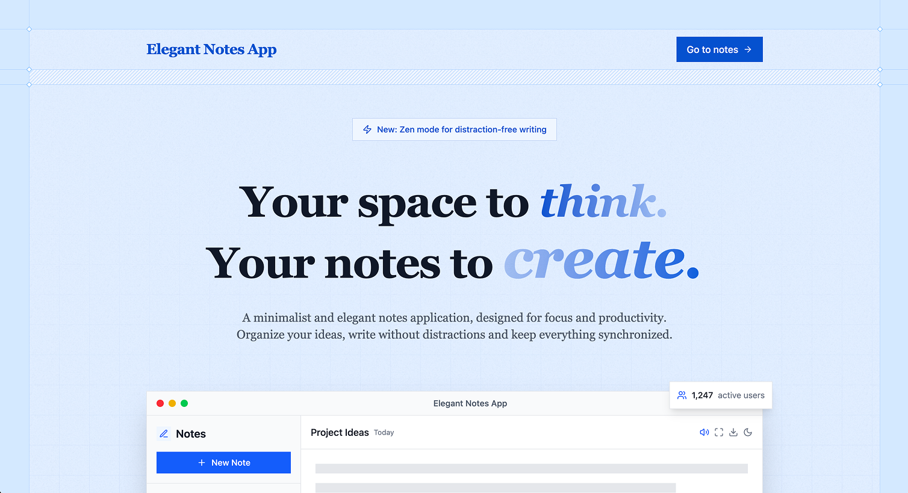

# Elegant Notes App

A minimalist and elegant notes application designed for focus, creativity, and productivity. Built with modern web technologies to provide a distraction-free writing experience.

Experience the app live: [Elegant Notes App](https://elegant-notes-app.vercel.app)

## Overview

This application was created to fulfill a personal need for a clean, intuitive note-taking solution and is now used by my team at work. It emphasizes simplicity, local storage, and privacy while providing essential features for organizing thoughts and ideas.

## Features

- **Distraction-free writing** - Clean interface that eliminates distractions
- **Intuitive organization** - Mark favorite notes, search quickly, and keep workspace organized
- **Local persistence** - Notes are automatically saved locally without requiring accounts
- **Responsive design** - Smooth experience on desktop and mobile devices
- **Optimized performance** - Fast and responsive application designed for workflow needs
- **Smart search** - Find notes instantly with built-in search functionality
- **Privacy-focused** - All data stays on your device, no tracking or data collection
- **Theme support** - Light and dark mode options

## Technology Stack

- **Framework**: Next.js 15 with React 19
- **Styling**: Tailwind CSS 4
- **State Management**: Zustand
- **Animations**: Motion (Framer Motion)
- **Icons**: Lucide React
- **Notifications**: Sonner
- **Themes**: Next Themes
- **TypeScript**: Full type safety

## Privacy

Your privacy is our priority. This application:

- Stores all data locally in your browser
- Does not collect, process, or store personal information
- Does not use analytics, tracking, or third-party services
- Works completely offline once loaded
- Requires no account creation or subscriptions

## License

This project is licensed under the MIT License - see the [LICENSE](LICENSE) file for details.

## Support

If you find this project useful, consider sponsoring its development:

[Sponsor on GitHub](https://github.com/sponsors/creativoma)

## Technical Details

The application uses browser local storage for data persistence, ensuring your notes remain private and accessible without internet connectivity. The interface is designed to be minimal and focused, removing unnecessary UI elements that could distract from writing.

Built with performance in mind, the app uses Next.js 15's latest features including Turbopack for fast development builds and optimized production bundles.

## Changelog

### Version 0.1.0 (Current)

- Initial release
- Core note-taking functionality
- Local storage persistence
- Responsive design
- Dark/light theme support
- Search functionality
- Privacy-focused approach
- Modern UI with smooth animations
